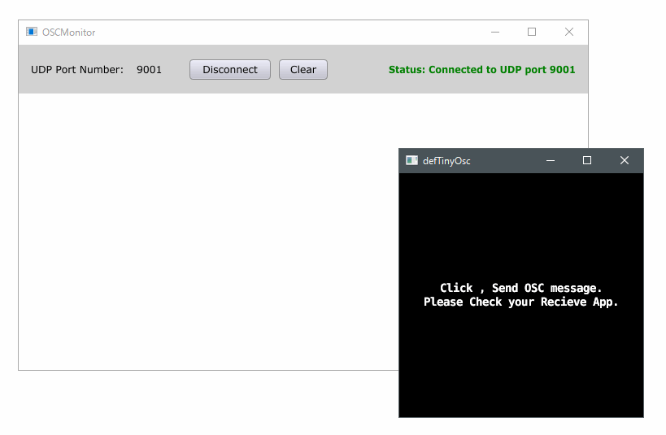

# defTinyOSC

the extension  for using **`tinyosc`** library in **`Defold`** game engine. 

* Defold Official Site ( https://www.defold.com/ )
* tinyosc ( https://github.com/mhroth/tinyosc ) 
* Open Sound Control ( http://opensoundcontrol.org/ )

**Note**  

1. this is **`beta`** version. some functions are not check and test.  
1. it is not finished implement **`Bundle`** type OSC message. please use single 
message with multis.

## Simple Preview 

[#] when send "random float" OSC message from defold app to another app which is for recieve OSC messsage.( sending by mouse click ).  I used "OSC monitor" app from example of [**juce library**]( https://github.com/WeAreROLI/JUCE ).

## Installation

please copy **``TinyOsc``** folder to your **``defold project directory``**.

## Functions

see Documents folder.

## License 

* tinyosc ( https://github.com/mhroth/tinyosc ) [ ISC License ]
* defUDP from defNet ( at Example ) (https://github.com/britzl/defnet ) [MIT License]

